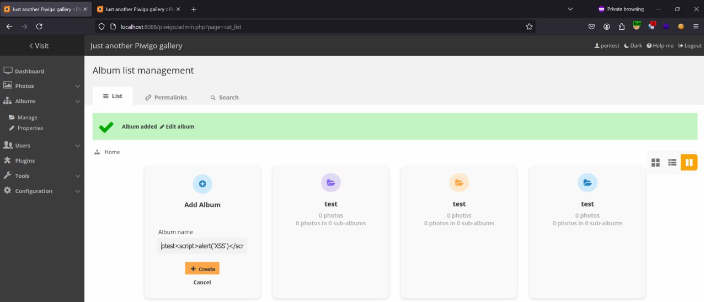

## In Piwigo v14.5.0, I found XSS Vulnerability in function Add Album  
Piwigo v14.5.0: [https://github.com/Piwigo/Piwigo]  

## Reproduce bug: 
Step 1: Login with admin account and go to Add Album function.

Step 2: Add album with payload XSS in album name

Burp request add album

Step 3: Payload trigger

Payload trigger in dashboard

Burp request access to dashboard

